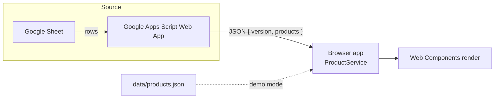

# Digital Menu

> Digital menu / online restaurant card rendered from a Google Sheet — built for small businesses.

[](https://opensource.org/licenses/MIT)

**digital-menu** is a fully responsive online restaurant menu. It is built with **vanilla HTML, CSS and JavaScript** — no framework, no build step, no package manager. A small business can publish a menu that keeps its own look and feel while the content is driven by a simple data source.

## Features

- **Rendered from a Google Sheet** — menus are published as structured JSON by a Google Apps Script Web App; the app fetches and renders them dynamically.
- **Web Components (vanilla)** — each UI block is a self-contained Custom Element with Shadow DOM, built on a shared `BaseComponent` class using ES Modules.
- **Fully responsive** — designed for phones first, then tablets and desktops.
- **Internationalization** — Spanish, English, Portuguese (French partial). The user's language is remembered locally.
- **Menu sections and filtering** — Starters, Main courses, Drinks, Desserts, plus a full-service view and a category slider filter.
- **Featured products carousel** — optional highlight carousel behind a feature flag.
- **No build step** — plain ES Modules loaded in the browser. Deployable to GitHub Pages as static files.
- **Zero runtime framework** — open-source-friendly, easy to inspect and customize.

## Table of contents

- [Demo / Live](#demo--live)
- [How it works](#how-it-works)
- [Quick start](#quick-start)
- [Project structure](#project-structure)
- [Architecture](#architecture)
- [Data schema](#data-schema)
- [Connecting your own Google Sheet](#connecting-your-own-google-sheet)
- [Configuration](#configuration)
- [Internationalization](#internationalization)
- [Accessibility & responsive](#accessibility--responsive)
- [Deployment](#deployment)
- [Contributing](#contributing)
- [License](#license)

## Demo / Live

**Live demo:** <https://montesgp.github.io/digital-menu/>

> The demo uses **local mock data** from `data/products.json` so the tool can be seen working without a linked spreadsheet. This is intentional — see [How it works](#how-it-works).

## How it works

The app is designed to display a menu that lives in any **Google Sheet**, published as JSON through a **Google Apps Script Web App**:

```
Google Sheet → Google Apps Script Web App (JSON { version, products }) → Browser app (fetch + cache) → Dynamic Web Component render
```

1. A Google Apps Script Web App reads a Sheet and returns a JSON payload shaped as `{ "version": ..., "products": [...] }`.
2. The browser app fetches that endpoint (with a `?t=Date.now()` cache buster), caches the result on `window.cachedProducts`, and filters to items with `stock > 0`.
3. `ProductService` delivers the product list to the Web Components, which render the menu.

The current deployable demo does **not** use a live Sheet. Instead, the active components read the local mock file `data/products.json` (exposed at `storeConfig.site.url/data/products.json`) so the project can be evaluated and demoed without any backend set up. To connect your own spreadsheet, see [Connecting your own Google Sheet](#connecting-your-own-google-sheet).

## Quick start

Because the app relies on ES Modules and fetches (CORS), **it must be served over HTTP** — you cannot open `index.html` directly from the file system (`file://`).

Pick any of these:

**Option A — Node http-server**

```bash
npx http-server . -p 8080
```

Then open <http://127.0.0.1:8080/digital-menu>.

**Option B — VS Code Live Server**

Install the *Live Server* extension, right-click `index.html`, and choose **Open with Live Server**.

**Option C — Included debug launcher**

The repository ships `.vscode/launch.json` that launches Chrome against `http://localhost:8080`. Set up a static server on port `8080` (for example via Option A) and press **F5**.

### Environment detection

`config/env.js` auto-detects the environment from the hostname and path:

| Environment | Detection | Config used |
|-------------|-----------|-------------|
| `local` | `localhost` / `127.0.0.1` | `config/config.local.js` |
| `dev` | `dev.*` hostname or `/dev/` path | `config/config.dev.js` |
| `prod` | default | `config/config.prod.js` |

To change the demo content, edit `data/products.json`.

## Project structure

```
digital-menu/
├── components/                  Web Components (Custom Elements + Shadow DOM)
│   ├── base/                    BaseComponent base class + template loader
│   ├── header/                  App header (cover / navbar / navbar-logo variants)
│   ├── footer/                  App footer (title, description, social links)
│   ├── mobile-navbar/           Mobile bottom navigation
│   ├── language-selector/       Language switcher with flags (es / en / pt)
│   ├── category-slider/         Category filter slider
│   ├── product-carousel/        Featured products carousel (feature-flag)
│   └── service-menu/            Menu navigation and service views
│       ├── starters-service/    Starters section
│       ├── main-service/        Main courses section
│       ├── drinks-service/      Drinks section
│       ├── desserts-service/    Desserts section
│       └── full-service/        Full menu view
├── config/                      Per-environment configuration
│   ├── env.js                   Auto-detects local / dev / prod
│   ├── config.js                Loads the right config for the environment
│   └── config.{local,dev,prod}.js
├── data/
│   └── products.json            Demo (mock) product data
├── services/                    App services (ProductService, navigation, feature, device)
├── assets/
│   ├── i18n/                    Translation files (es / en / pt / fr) + translation service
│   └── animations/              Lottie loader animations
├── styles/
│   └── main.css                 Global styles
├── scripts/
│   └── check-structure.mjs      Structure validator run in CI
├── docs/
│   ├── ARCHITECTURE.md                    Architecture overview
│   └── digital-menu-architecture-diagram.drawio  Editable architecture diagram
├── index.html                   App entry point
├── main.js                      Module entry point (loads components)
├── .github/                     Issue/PR templates, workflows
└── README.md
```

## Architecture

See [docs/ARCHITECTURE.md](docs/ARCHITECTURE.md) for the full data-flow and component breakdown.

> **Editable diagram:** [`docs/digital-menu-architecture-diagram.drawio`](docs/digital-menu-architecture-diagram.drawio) — draw.io source, renders inline on GitHub.



## Data schema

Each product in `data/products.json` (or returned by your Sheet endpoint) uses the following shape:

| Field | Type | Description |
|-------|------|-------------|
| `name` | string | Product name (required). |
| `description` | string | Short description shown on the menu. |
| `service` | string | Menu section: `starter`, `main`, `drink`, `dessert`. |
| `category` | string | Category grouping (e.g. `General`, `WithAlcohol`). |
| `categoryDescription` | string | Human-readable category label. |
| `subcategory` | string | Optional subcategory. |
| `section` | string | Section within the service (e.g. `Calientes`, `Wines`). |
| `subSectionOne` | string | Optional subsection heading. |
| `subSectionTwo` | string | Optional second subsection heading. |
| `sectionObservations` | string | Notes for a section (e.g. side-dish default). |
| `price` | string | Display price as a string (e.g. `"15 USD"`). |
| `size` | string | Optional portion size (e.g. `"Big"`). |
| `ingredients` | string | Ingredient list, comma-separated. |
| `stock` | number | Optional; products with `stock <= 0` are filtered out by `ProductService`. |

## Connecting your own Google Sheet

1. **Prepare a Sheet** whose rows describe your products. Use the columns that map to the [Data schema](#data-schema) above.
2. **Create a Google Apps Script Web App** bound to the Sheet or to a separate script that reads it, and have it respond with JSON:

   ```json
   {
     "version": "123",
     "products": [ { "name": "...", "service": "main", "price": "15 USD", ... } ]
   }
   ```

   Publish it as *Anyone with the link can access* / *Execute as me*.
3. **Point the app at your endpoint.** Open `config/config.prod.js` (and `config.dev.js` / `config.local.js` as needed) and set the URL:

   ```js
   export const apiConfig = {
     google: {
       SheetsUrl: "https://script.google.com/macros/s/YOUR_SCRIPT_ID/exec",
     },
   };
   ```

4. **Cache buster (optional).** `ProductService` already appends `?t=${Date.now()}` to the URL to bypass caching.

`ProductService` (in `services/ProductService.js`) performs the fetch, caches products on `window.cachedProducts`, parses `price` and `stock`, and filters out entries where `stock <= 0`.

## Configuration

Configuration lives in `config/`. `config/env.js` selects the active file, and `config/config.js` re-exports `storeConfig` and `apiConfig`.

The main `storeConfig` object includes:

- `site` — display name (`name`, `description`, `shortName`, `subtitle`, `title`), `url` (the site base URL), preview image, loader animation overrides, and header appearance.
- `features` — feature flags such as `productCarousel` (titles and per-section visibility).
- `default` — defaults such as `language`.
- `search` — placeholder text.
- `footer` — per-language footer title, description, copyright, and social links.

> **Important:** in production, `storeConfig.site.url` must point to the base URL of your GitHub Pages site (for example `https://montesgp.github.io/digital-menu/`), because it is used to resolve the mock data path and other site-relative URLs.

## Internationalization

Translations live in `assets/i18n/` as JSON per language:

- `es.json` — Spanish
- `en.json` — English
- `pt.json` — Portuguese
- `fr.json` — French (partial)

Elements are translated via `data-i18n` attributes and the `TranslationService` (in `assets/i18n/translationService.js`). The active language is persisted in `localStorage`, and the `language-selector` exposes `es`, `en`, and `pt` via flag buttons.

To add or edit a language:

1. Create or edit `assets/i18n/<lang>.json` with the key/value pairs.
2. Reference the keys in markup with `data-i18n` attributes (or through the translation service in JS).
3. Add a flag file under `components/language-selector/flags/` if you want the language exposed in the selector.

## Accessibility & responsive

- Semantic HTML and a clean document outline.
- Layout adapts to mobile, tablet, and desktop viewports.
- Navigation includes dedicated mobile patterns (`mobile-navbar`, back/home buttons).
- All interactive components are built as native Custom Elements and remain keyboard-operable and screen-reader-friendly by default; keep contrast and focus states in mind when customizing.

## Deployment

The project is a static site and is deployed to **GitHub Pages** directly from the `main` branch (branch source).

1. In the repository **Settings → Pages**, set **Source** to `Deploy from a branch` and select `main` / root.
2. Push to `main`; Pages serves the content at `https://montesgp.github.io/digital-menu/`.
3. Confirm `config/config.prod.js` → `storeConfig.site.url` points to your Pages base URL (see [Configuration](#configuration)).

If you serve the site under a subpath, keep the production base URL in sync with that path.

### Release flow (gitflow)

This repository uses a lightweight gitflow:

- `main` is the production branch and only receives **promotion pull requests** from `dev`.
- `dev` is the integration branch. Feature branches are cut from `dev` and merged back into it.
- Promotions are merged with **squash** (so `main` keeps a linear history).

**Keep the merge base fresh.** Because squash merges create new commits instead of shared history, a stale merge base makes the next promotion show phantom conflicts in files both branches changed. After every promotion, merge `main` back into `dev`:

```bash
git checkout dev
git merge main        # clean when dev is up to date
git push
```

This keeps `merge-base(dev, main) == main` so the next promotion is a clean diff.

## Contributing

Please read [CONTRIBUTING.md](CONTRIBUTING.md) for the contribution workflow (branching model, PR requirements, and commit conventions) before opening an issue or a pull request. See also [CODE_OF_CONDUCT.md](CODE_OF_CONDUCT.md) and [SECURITY.md](SECURITY.md).

## License

This project is licensed under the [MIT License](LICENSE). Copyright (c) 2025 Patricio Montes.

## Scan me


Scan this code with your phone camera to open the live demo. Print it on tables, cards, and flyers for instant access.
