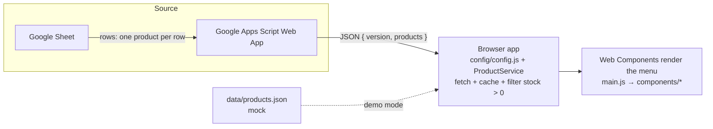

# Architecture

> **Editable diagram:** [`digital-menu-architecture-diagram.drawio`](./digital-menu-architecture-diagram.drawio) — open it with the draw.io desktop app or [app.diagrams.net](https://app.diagrams.net) to edit. GitHub renders it inline.



*Figure 1 — End-to-end flow of `digital-menu`.*

## Overview

`digital-menu` is a static, framework-less web application. It renders a restaurant menu in the browser from data published by a **Google Apps Script Web App** backed by a **Google Sheet**, and falls back to local mock data for the demo deployment.

## Data flow

```
Google Sheet
   │  (rows: products)
   ▼
Google Apps Script Web App           config/apiConfig.google.SheetsUrl
   │  (returns JSON { version, products })
   ▼
Browser app — config/config.js loads
   │  ProductService.fetchProducts()
   │    fetch(SheetsUrl + "?t=" + Date.now())   ← cache buster
   │    cache window.cachedProducts
   │    filter stock > 0
   ▼
Web Components render the menu
   main.js → components/*  (Custom Elements + Shadow DOM)
```

1. **Google Sheet** — the source of truth with one row per product.
2. **Google Apps Script Web App** — publishes the Sheet as JSON in the shape `{ version, products }`.
3. **Configuration** — `config/env.js` detects the environment (local / dev / prod) and `config/config.js` imports the matching config file, exposing `apiConfig.google.SheetsUrl`.
4. **ProductService** — fetches the endpoint with a cache buster, caches the result on `window.cachedProducts`, and filters out items with no stock.
5. **Components** — `main.js` imports every Web Component; each component fetches its own `.html`/`.css` template and renders inside its Shadow DOM.

> **Demo note:** the live demo does not use a live Sheet. The active components read `data/products.json` (mock) exposed at `storeConfig.site.url/data/products.json`, so the tool is demonstrable without any linked spreadsheet.

## Environments

| Environment | Detection | Config |
|-------------|-----------|--------|
| `local` | `localhost` / `127.0.0.1` | `config/config.local.js` |
| `dev` | `dev.*` host or `/dev/` path | `config/config.dev.js` |
| `prod` | default | `config/config.prod.js` |

## Component model

- Every UI block is a **Custom Element** extending `HTMLElement` (or the shared `BaseComponent` in `components/base/base-component.js`).
- Each component owns its `.js`, `.html`, and `.css` files in `components/<name>/` and renders into an open **Shadow DOM**.
- `BaseComponent.loadTemplate(scriptUrl)` fetches the sibling `.html` and `.css` for a component.
- Cross-cutting concerns (translation, navigation, feature flags, device detection) live in `services/` and `assets/i18n/`.

## Third-party (CDN only)

- Tiny Slider 2.9.4
- Lottie Web
- Font Awesome 6.4.0

Loaded via `<script>`/`<link>` tags in `index.html`. There is no npm, no bundler, and no build step.

## Concurrency and helpers

- **No state synchronization layer** — the app is browser-only and stateless across requests (other than `window.cachedProducts` and the i18n language stored in `localStorage`).
- Local server required for development (ES Modules / CORS prohibit `file://`).